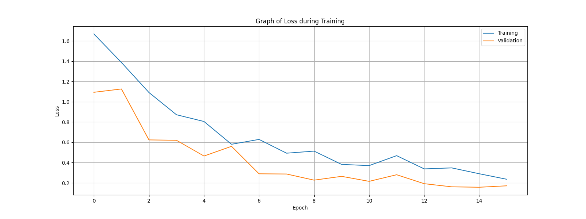

# Fruit Classification: Fresh vs Rotten
### Deep Learning | Transfer Learning | Data Augmentation

This project was developed as part of a technical assessment for the NVIDIA Deep Learning Institute (DLI). The goal is to classify images of fruit between fresh and rotten states using a deep neural network focused on high accuracy and generalization.

---

## Project Overview
The classifier was trained to identify 6 distinct categories of fruit:
* **Apples**: Fresh and Rotten
* **Bananas**: Fresh and Rotten
* **Oranges**: Fresh and Rotten

The established target for approval was a validation accuracy of at least 92%.

---

## Model Architecture
For this challenge, the Transfer Learning technique was utilized.

* **Base Model**: VGG16 pre-trained on the ImageNet dataset.
* **Feature Extraction**: The convolutional layers of the VGG16 were maintained to extract complex features from the images.
* **Custom Head**: 
    * GlobalAveragePooling2D for dimensionality reduction.
    * Dense Layer with 256 neurons and ReLU activation.
    * Dropout (0.5) to prevent overfitting.
    * Output Layer with 6 neurons and Softmax activation.

---

## Applied Techniques

### 1. Data Augmentation
Due to the dataset size, real-time data augmentation was applied to make the model more robust against variations in angle, zoom, and position:
* Rotation, Zoom, Shift, and Horizontal Flip.

### 2. Fine-Tuning and Optimization
* **Optimizer**: RMSprop with a reduced learning rate ($10^{-5}$) to ensure stability during the fine-tuning of weights.
* **Loss Function**: Categorical Crossentropy (appropriate for multiple classes).

---

## Results
The model achieved solid performance, exceeding the evaluation requirements:
* **Validation Accuracy**: ~93.75%
* **Final Loss**: ~0.17


> *Stable convergence observed between training and validation loss over 16 epochs.*

---

## How to Run
1. Clone the repository.
2. Ensure you have the necessary libraries installed:
   ```bash
   pip install tensorflow matplotlib